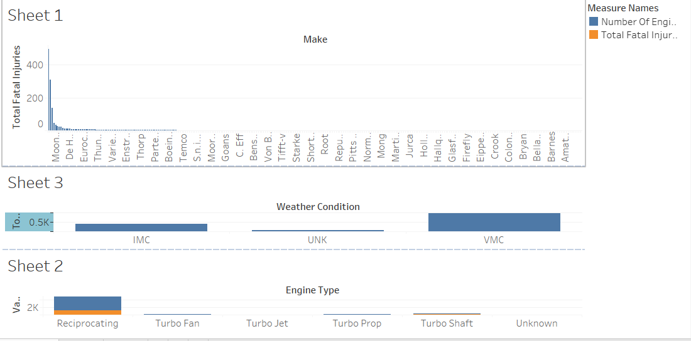

# Aircraft Incident Analysis for Operational Risk Mitigation

## Overview

This project analyzes aircraft incident and accident data to help the company in safely entering the airline industry by selecting aircraft with the lowest operational risk. I examined factors such as total injuries, aircraft make/model, weather conditions, flight phases, engine configurations, and aircraft categories. By cleaning the data, grouping key variables, and creating visualizations, I identified patterns that influence injury rates. The insights from this analysis will guide the company to purchase  safer aircraft models, prioritize pilot training during critical flight phases, implement safety measures under different weather conditions, and design a fleet that reduces risk and builds customer trust. In summary, this project uses data to help the company launch a safer, smarter aviation operation.

---

## Business Understanding

### Stakeholders

- **Directors / Business Owners**: Prioritize purchasing aircraft with minimal safety risks to protect reputation and financial stability.
- **Operations Manager**: Optimize fleet scheduling and logistics using safety-focused insights.
- **Pilots and Crew Members**: Ensure aircraft reliability and safety across diverse operational conditions.

### Key Business Questions

1. Which aircraft makes/models have the lowest historical injury rates?
2. How do weather conditions impact injury severity?
3. Does engine configuration (number/type) influence safety?
4. What operational strategies minimize risk when building a new fleet?

---

## Data Understanding and Analysis

### Source of Data

The dataset is sourced from the **National Transportation Safety Board (NTSB)**, detailing incidents/accidents involving injuries, aircraft characteristics, and environmental factors.

### Description of Data

The dataset includes the following key columns:

| Column Name                        | Description                                                         |
| ---------------------------------- | ------------------------------------------------------------------- |
| Make                               | Aircraft manufacturer (e.g., Cessna, Bell)                          |
| Model                              | Aircraft model                                                      |
| Total fatal/serious/minor injuries | Number of injuries by severity level                                |
| Injury severity                    | Classification of incident severity (Fatal, Serious, Minor)         |
| Broad phase of flight              | Flight phase during incident (Takeoff, Landing, Cruise)             |
| Weather Condition                  | Weather at incident time (e.g., VMC, IMC)                           |
| Number of engines and engine type  | Engine count and type (e.g., Single-engine reciprocating, Turbojet) |
| Aircraft Category                  | Classification (Small Airplane, Helicopter)                         |

### Key Visualizations

## Conclusion

### Summary of Findings

1. **Aircraft Make/Model**: Manufacturers like **Bell** demonstrated lower total injuries, making them safer choices.
2. **Weather Impact**: A large number of injuries occurred under Visual Meteorological Conditions (VMC), likely because more flights happen during clear weather. However, Instrument Meteorological Conditions (IMC) like fog and rain still pose significant risks that should not be ignored.
3. **Engine Configuration**: Single-engine reciprocating aircraft were linked to more incidents, favoring multi-engine turbine models for commercial safety.

### Operational Recommendations

- **Fleet Procurement**: Prioritize multi-engine, turbine-powered aircraft (e.g., Bell 206) with low injury histories.
- **Weather Policies**: Implement strict safety checks for IMC Conditions despite fewer flights.
- **Aircraft Diversity**: Avoid high-risk categories (e.g., small single-engine planes) for commercial operations.

By leveraging these insights, the company can strategically reduce operational risks and establish a trusted aviation brand.
